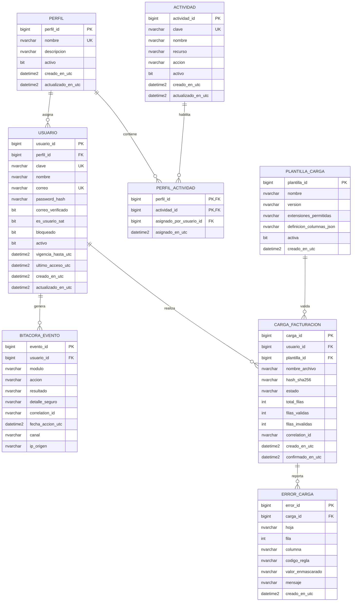

# Diagrama entidad-relación propuesto

## Relaciones y reglas principales

| Relación | Cardinalidad | Regla |
|---|---|---|
| Perfil → Usuario | 1:N | Un usuario pertenece a un perfil operativo. Si se requieren varios perfiles por usuario, se sustituye por una tabla puente tras validación de negocio. |
| Perfil ↔ Actividad | N:M | `perfil_actividad` define permisos explícitos; evita privilegios implícitos. |
| Usuario → BitácoraEvento | 1:N | Todo evento crítico identifica al usuario responsable o una cuenta técnica controlada. |
| Usuario → CargaFacturacion | 1:N | Permite saber quién inició y confirmó cada carga. |
| PlantillaCarga → CargaFacturacion | 1:N | Cada lote conserva la versión de plantilla con que fue validado. |
| CargaFacturacion → ErrorCarga | 1:N | Una carga puede contener cero o más errores localizables. |
