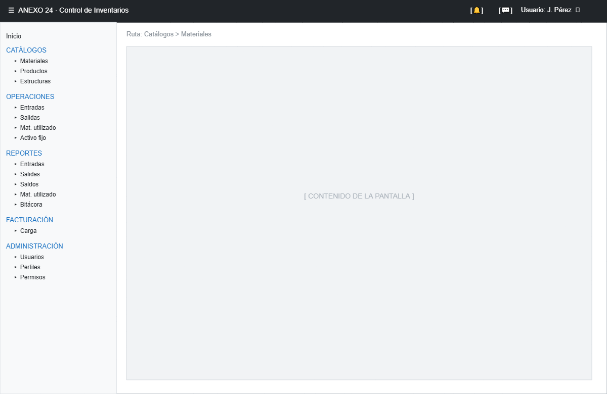
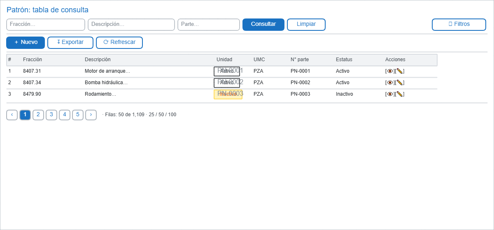
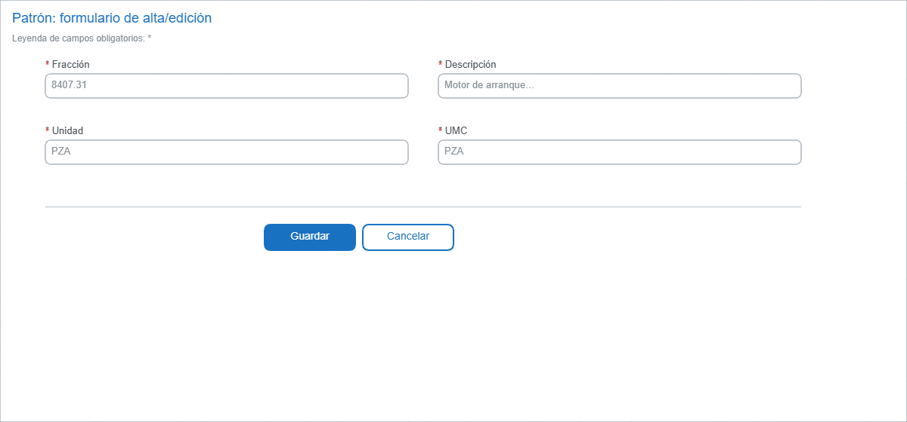

# Patrones base: layout general de la aplicación

## Objetivo

Definir el "shell" común (barra lateral + encabezado + contenido) y los patrones repetibles de tabla, formulario y estados que todas las pantallas del sistema Anexo 24 usarán. Ningún módulo debe inventar estructuras distintas.

## 1. Shell de la aplicación

### Regiones

| Región | Contenido | Reglas |
|---|---|---|
| Barra lateral | Navegación por módulos y submenús | Solo se muestran ítems cuyo permiso el usuario posee (**menor privilegio**). Colapsable. |
| Encabezado | Menú ☰ (colapsar), notificaciones, nombre de usuario, cerrar sesión | El menú de usuario incluye "Cambiar contraseña". El botón ⏻ cierra sesión y limpia tokens. |
| Migas de pan | Ruta actual (ej. `Catálogos > Materiales`) | En cada navegación. |
| Contenido | La pantalla activa | Patrones de esta sección. |

## 2. Patrón de tabla (pantallas de consulta)

### Reglas

- **Filtros** arriba, colapsables; `[Consultar]` aplica, `[Limpiar]` restablece. Enter en un filtro consulta.
- **Toolbar**: `[＋ Nuevo]` (solo si permiso de alta), `[↧ Exportar]`, `[⟳ Refrescar]`.
- **Encabezados de columna** clicables para ordenar; indicador de orden ▲/▼.
- **Paginación** abajo: `< 1 2 3 >`, selector de 25/50/100 por página.
- **Acciones por fila**: `[👁]` ver detalle, `[✎]` editar; ambas requieren permiso específico.
- Columnas visibles por módulo en cada wireframe (ver archivos 03–07).

## 3. Patrón de formulario (altas/ediciones)

### Reglas

- Grid de **2 columnas** con etiqueta arriba del campo; `*` indica obligatorio.
- Validación **por campo, al salir** (blur); mensaje inline rojo + borde en el campo.
- `[Guardar]` se deshabilita mientras el formulario sea inválido; `[Cancelar]` vuelve sin guardar.
- Error de servidor: patrón de la sección 5 (dialog con `correlationId`).

## 4. Estados obligatorios por pantalla

| Estado | Visualización | Detalle |
|---|---|---|
| Carga | Spinner/skeleton en la zona de datos | Nunca pantalla en blanco; los filtros quedan visibles pero deshabilitados. |
| Sin resultados | Ícono + "No se encontraron registros con los filtros aplicados" | La tabla muestra mensaje centrado, no filas vacías; botones paginación ocultos. |
| Error | Dialog/tarjeta con mensaje accionable + `correlationId` | Log técnico del lado servidor; la UI nunca expone trazas. |
| Sin permiso | Pantalla 403: "No tiene permiso para acceder a este módulo" + acción "Volver al inicio" | No revela la existencia de módulos no autorizados en el menú. |
| Sesión expirada | Dialog: "Su sesión expiró" → redirige a Login | Tras inactividad configurada; conservar formularios sin enviar. |

## 5. Diálogos comunes

| Diálogo | Cuándo | Contenido |
|---|---|---|
| Confirmar | Acción destructiva o con impacto (inhabilitar, cancelar carga, limpiar tabla) | Texto del impacto + `[Cancelar]` / `[Confirmar]`, botón de riesgo en rojo. |
| Error | Fallo de servidor o de negocio | Mensaje + `correlationId` + `[Cerrar]`. |
| Información | Avisos no críticos | Mensaje + `[Aceptar]`. |

## 6. Notificaciones (toast)

- Éxito: verdes, 4 segundos, posición inferior derecha.
- Error: rojas, permanecen hasta cerrarse, incluyen `correlationId` corto si aplica.
- Advertencia: ámbar, 6 segundos.

## 7. UX y accesibilidad transversal

- Navegación completa por **teclado** (tab order lógico, Enter consulta, Esc cierra diálogos).
- `aria-label` en botones de ícono (👁 "Ver detalle", ⏻ "Cerrar sesión").
- Contraste AA mín.; estado de foco visible en todos los controles.
- Mensajes de error asociados al control mediante `aria-describedby`.
- Fechas en formato `DD/MM/AAAA` con selector; horas `HH:MM`; zona horaria local para presentación (almacenamiento UTC).
- Cantidades decimales alineadas a la derecha con el número de decimales de la unidad (precisión definida por negocio, no truncar).