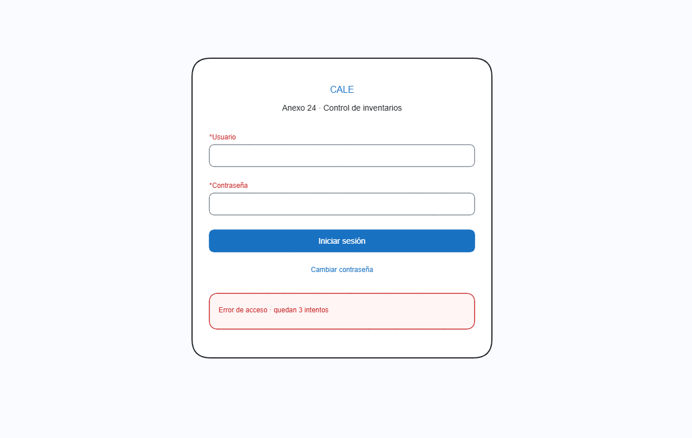

# Pantalla: Inicio de sesión

- **Caso de uso:** CU-001 — Iniciar sesión.
- **Permiso:** acceso público (cualquier usuario con cuenta activa).
- **Objetivo:** autenticar al usuario, cargar sus permisos y dirigirlo a su inicio. Nunca revelar si el error proviene del usuario o de la contraseña; nunca mostrar secretos.

## Wireframe


## Regiones

| Región | Contenido |
|---|---|
| Marca | Logotipo + nombre del sistema (identidad CALE). |
| Usuario | Campo de texto; autocompletar del navegador permitido. |
| Contraseña | Campo tipo `password` con control 👁 mostrar/ocultar (nunca visible por defecto). |
| Mensajes | Zona de error/alerta bajo los campos (patrón sección Validaciones). |
| Acción principal | Botón `[Iniciar sesión]` (disabled mientras campos vacíos). |
| Link secundario | `Cambiar contraseña` para restablecimiento. |

## Campos

| Control | Tipo | Reglas |
|---|---|---|
| Usuario | texto | Obligatorio. Longitud máx. 35 (límite observado). Trim. |
| Contraseña | password | Obligatoria. Mín. 8 caracteres (política de contraseña propuesta). |

## Validaciones y mensajes

| Condición | Mensaje al usuario | Comportamiento |
|---|---|---|
| Campo(s) vacío(s) tras intento | "Capture usuario y contraseña" | Botón permanece disabled hasta llenar ambos. |
| Usuario inexistente o contraseña incorrecta | "Credenciales incorrectas" (genérico, no revela cuál falló) | Registro en bitácora con `correlationId`; NO indica si el usuario existe. |
| 3 intentos fallidos seguidos (política propuesta) | "Credenciales incorrectas. 2 intentos restantes" | Contador visible; se informa el número restante a partir del 3.º fallo. |
| 5 intentos fallidos | Cuenta bloqueada → "Su cuenta fue bloqueada por intentos fallidos. Contacte al administrador" | Bloquea cuenta por política; bitácora. Navegar a pantalla de bloqueo. |
| Cuenta inactiva | "Su cuenta está inactiva. Contacte al administrador" | Sin inicio de sesión. |
| Cuenta vencida (vigencia terminada) | "Su contraseña/periodo venció. Debe cambiarla" | Flujo de cambio de contraseña forzado. |
| Primer acceso (política propuesta) | "Debe cambiar su contraseña la primera vez que ingresa" | Cambio obligatorio antes de continuar. |

## Flujo de cambio de contraseña (forzado o voluntario)

```
Login ──► ¿Primer acceso o vencida? ──Sí──► Formulario: [Actual] [Nueva] [Confirmar]
                                                │
                                                ├─ Nueva ≠ Actual
                                                ├─ Nueva cumple política (largo, complejidad)
                                                ├─ Confirmar = Nueva
                                                └─ [Guardar] ──► Sesión iniciada
```

- Voluntario: menú de usuario → "Cambiar contraseña": mismo formulario sin campo `Actual`? → **No**: siempre exige `Actual` (evita cambio por sesión secuestrada).
- La API nunca devuelve la contraseña ni su hash; las contraseñas se almacenan únicamente como hash fuerte (Argon2id/bcrypt).

## Notas de seguridad (crítico)

1. **Mensaje genérico** en credenciales inválidas (no "usuario no existe").
2. **Sin secretos en DOM**: campo `password`, nunca `text`; el 👁 se inicializa oculto.
3. **Rate limiting** de intentos por cuenta y por IP en la API (prevención de fuerza bruta).
4. **Token/sesión**: JWT firmado con expiración corta + renovación controlada; cerrado de sesión invalida el token.
5. Toda autenticación (éxito o fallo) registra evento en bitácora: usuario, fecha, resultado, `correlationId`.