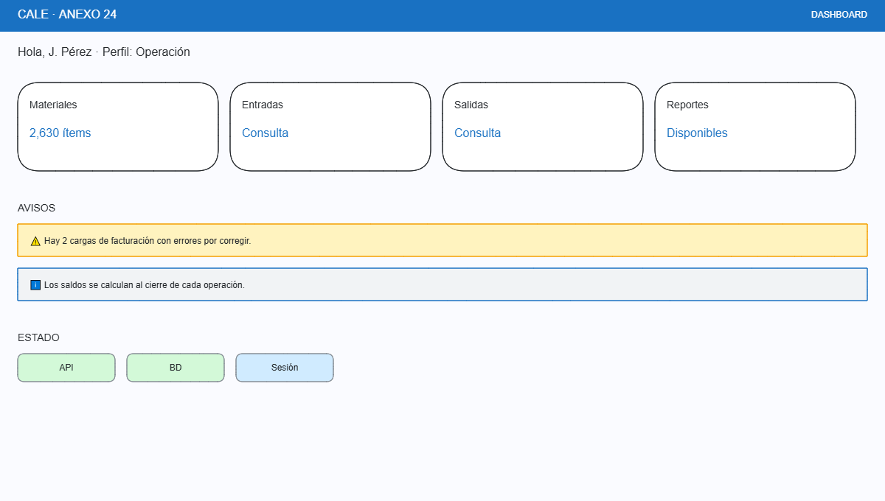

# Pantalla: Dashboard (inicio)

- **Caso de uso:** resultado de CU-001 (post-autenticación).
- **Permiso:** cualquier usuario con sesión válida; el contenido se filtra por sus permisos.
- **Objetivo:** dar acceso rápido a los módulos autorizados y avisos relevantes. Es la primera pantalla tras el login.

## Wireframe

## Regiones

| Región | Contenido |
|---|---|
| Saludo | Nombre del usuario + perfil activo. |
| Accesos rápidos | Tarjetas de módulos **solo si el usuario tiene permiso** (menor privilegio). El número de tarjetas varía por perfil. |
| Avisos | Alertas relevantes: contraseña próxima a vencer, cargas pendientes o con errores, bloqueos. |
| Estado del sistema | Indicadores de salud (API, BD, sesión) — alimentados por `/actuator/health` y estado de token. |

## Comportamiento

| Evento | Comportamiento |
|---|---|
| Clic en tarjeta | Navega al módulo correspondiente (p.ej. Materiales → catálogo). |
| Sin permisos para ningún módulo | Se muestra mensaje: "Su perfil no tiene módulos asignados. Contacte al administrador" + botón "Cambiar contraseña". |
| API/BD no disponible | Semáforos en rojo + toast "Servicio no disponible. Ref: `correlationId`". Se permite navegar a módulos de solo lectura si responden. |
| Sesión expirada | Dialog "Su sesión expiró" → re-dirige a Login. |

## Notas

- El dashboard **no muestra datos de negocio sensibles** por defecto (saldos, cantidades); solo accesos y avisos. Evita exposición innecesaria en pantalla inicial.
- Sin rol asignado el usuario ingresa sin tarjetas (visible para administración).
- Actualizable con el patrón de estados de `00-layout-general.md`.