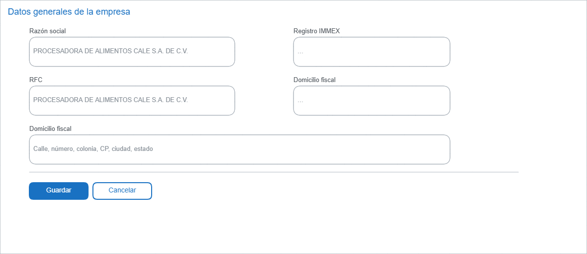
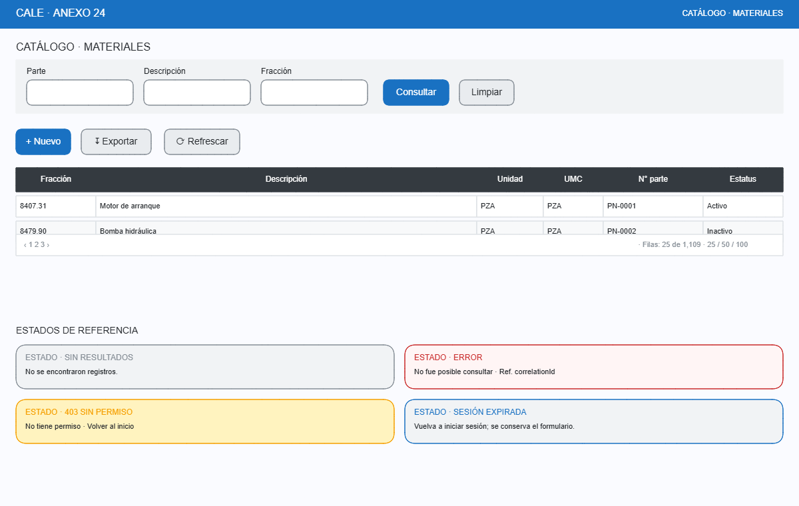
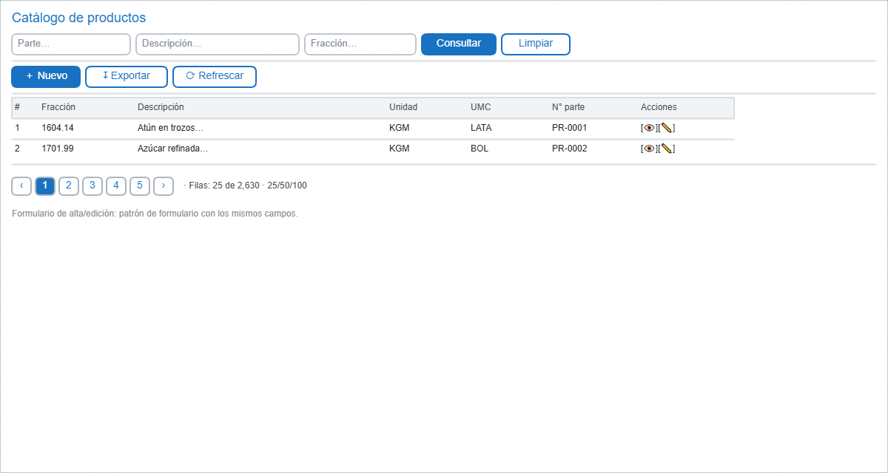
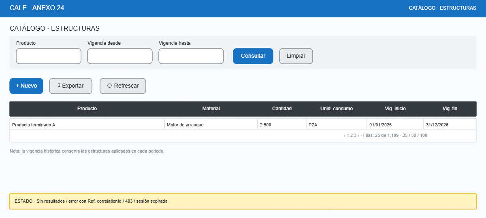

# Catálogos: Datos generales, Materiales, Productos, Estructuras

- **Objetivo:** consultar y mantener los catálogos maestros. Pantallas de **consulta** (solo lectura) salvo las acciones de alta/edición que el permiso autorice.
- **Permiso:** por módulo según `matriz-permisos-propuesta.md` (consultar / crear / editar / inhabilitar).

---

## 1. Datos generales de la empresa

Consulta única; el sistema muestra los datos maestros de CALE. Edición con `[Guardar]`/`[Cancelar]`.

| Campo | Tipo | Reglas |
|---|---|---|
| Razón social | texto nvarchar | Obligatorio. |
| RFC | texto | Obligatorio, formato RFC válido. |
| Registro IMMEX | texto | Obligatorio si aplica. |
| Domicilio fiscal | texto multilínea | Obligatorio. |

---

## 2. Catálogo de materiales

Columnas observadas: fracción arancelaria, descripción, unidad TIGIE, UMC, número de parte. Filtros: parte, descripción, fracción; paginación.

| Columna | Detalle |
|---|---|
| Fracción | Código TIGIE. |
| Descripción | Texto de negocio (máx. observado compat. con nvarchar). |
| Unidad (TIGIE) | Catálogo de unidades. |
| UMC | Unidad de medida de comercialización. |
| N° parte | Identificador de negocio. |

Formulario de alta/edición: patrón `00-layout-general.md` con los mismos campos + `[Guardar]/[Cancelar]`; `N° parte` único validado por la API.

---

## 3. Catálogo de productos

Mismas columnas que materiales pero aplicado a productos terminados: fracción, descripción, unidad, UMC, número de parte. Mismos filtros (parte, descripción, fracción) y paginación.

---

## 4. Catálogo de estructuras (lista de materiales)

Relación **producto → materiales** con cantidad, unidad de consumo y vigencia. Filtros: producto y rango de fechas (consulta por vigencia vigente o histórica).

| Campo | Detalle |
|---|---|
| Producto | Código + descripción del producto terminado. |
| Material | Código + descripción del material componente. |
| Cantidad | Decimal, precisión por unidad (no truncar). |
| Unidad de consumo | Cantidad necesaria por unidad de producto. |
| Vigencia inicio/fin | Periodo en que la estructura aplica (consulta histórica soportada). |

**Regla:** el rango de vigencia es opcional; sin él se muestran las estructuras vigentes a hoy. La API valida inicio ≤ fin y devuelve error accionable si no.

## Notas transversales (catálogos)

- Todos los filtros de texto son búsqueda parcial (LIKE) con trim; la API pagina y ordena.
- Las combinaciones duplicadas (p.ej. misma fracción+descripción o producto+material+vigencia) se rechazan con mensaje que indique el registro en conflicto.
- Estados carga/sin datos/error/sin permiso: patrón `00-layout-general.md`.