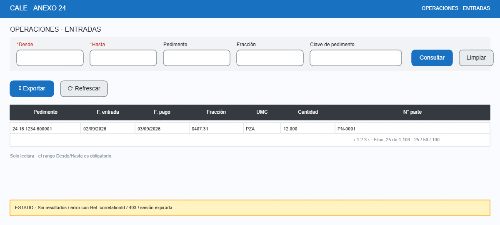
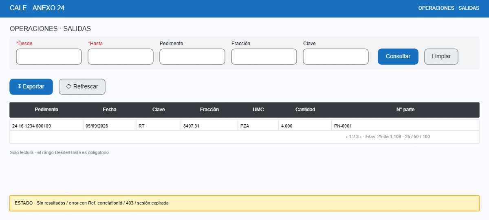
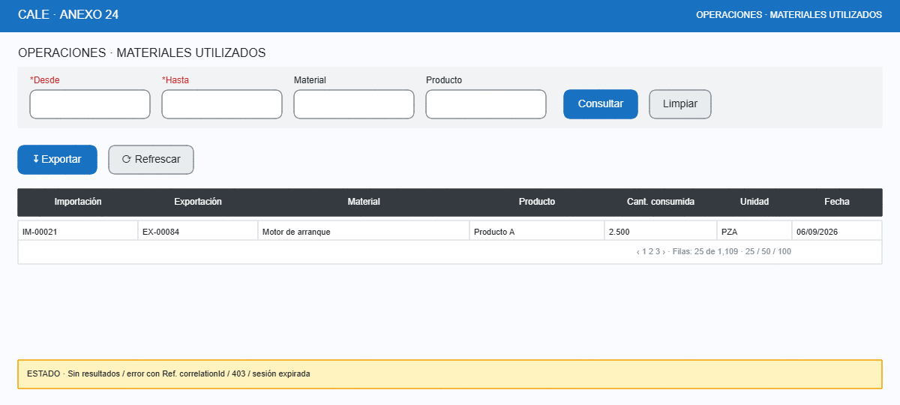
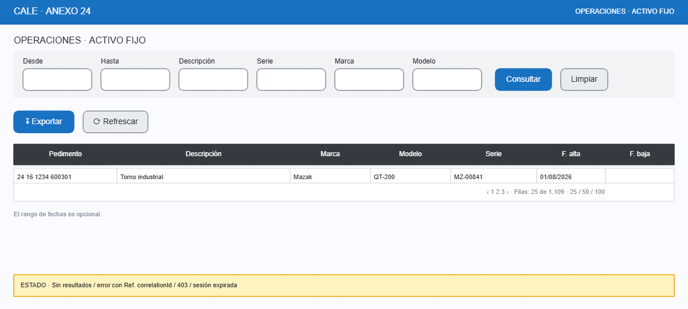

# Operaciones: Entradas, Salidas, Materiales utilizados, Activo fijo

- **Caso de uso:** CU-030 — Consultar operación.
- **Objetivo:** consultar movimientos del almacén con **rango de fechas obligatorio** y filtros opcionales; datos de solo lectura provenientes de Módulo C vía adaptador.
- **Permiso:** consulta por módulo; exportación con permiso específico.

## Regla crítica de consulta

El **rango de fechas es obligatorio**: sin él el botón `[Consultar]` permanece deshabilitado y se muestra ayuda "Defina el rango de fechas". Previene barridos masivos accidentales en Módulo C.

---

## 1. Entradas

Columnas: pedimento, clave de pedimento, fecha de entrada, fecha de pago, fracción, UMC, cantidad, número de parte. Filtros: rango obligatorio + opcionales.

## 2. Salidas

Columnas: pedimento, fecha, clave, fracción, UMC, cantidad, número de parte. Rango obligatorio.

## 3. Materiales utilizados

Relación importación → exportación → consumo. Columnas: importación, exportación, material, producto, cantidad consumida, unidad, fecha. Rango obligatorio.

## 4. Activo fijo

Columnas: pedimento, descripción, marca, modelo, número de serie, fechas. Rango opcional (a diferencia de las demás) + filtros observados.

## Validaciones y mensajes

| Condición | Mensaje | Comportamiento |
|---|---|---|
| Rango sin definir (entradas/salidas/mat. utilizado) | "Defina el rango de fechas" | `[Consultar]` deshabilitado. |
| Desde > Hasta | "La fecha inicial no puede ser posterior a la final" | Campo Hasta resaltado; sin consulta. |
| Rango > límite configurado (p.ej. 1 año) | "El rango máximo permitido es de 365 días" | Bloquea; sugiere acotar. |
| Sin resultados | "No se encontraron movimientos en el rango indicado" | Tabla vacía con mensaje (no es error). |
| Fallo de consulta a Módulo C | "No fue posible consultar el módulo. Ref: `correlationId`" | Dialog de error + bitácora con detalle técnico. |
| Permiso insuficiente | Pantalla 403 del patrón base | Sin acceso al módulo. |

## Notas

- Todas las pantallas son **solo lectura**; no hay botones de alta/edición (los datos son históricos de Módulo C).
- `[↧ Exportar]` descarga en el mismo formato de columnas visibles (XLSX/CSV) y exige permiso específico.
- La paginación, orden y filtros parciales siguen el patrón `00-layout-general.md`.
- Detalle de fila (`[👁]`): dialog con los campos completos del movimiento cuando existan columnas adicionales no mostradas.