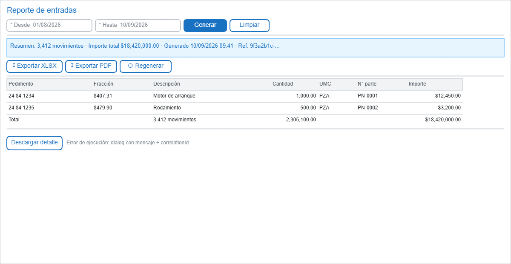

# Reportes: Entradas, Salidas, Saldos, Materiales utilizados, Bitácora

- **Caso de uso:** CU-040 — Generar reporte.
- **Objetivo:** producción de reportes consolidados con exportación y **diagnóstico rastreable**: todo fallo muestra `correlationId` (la auditoría detectó 5 reportes que fallaban con mensaje genérico).
- **Permiso:** por reporte según matriz de permisos; exportación con permiso propio.

## Patrón común de reporte

## Reportes incluidos

### 1. Reporte de entradas
Agrupación por pedimento/fracción con totales por UMC: suma de cantidades por fracción, número de pedimentos, rango.

### 2. Reporte de salidas
Misma estructura que entradas pero sobre salidas; permite cruce con exportaciones si la regla de negocio lo define.

### 3. Reporte de saldos
Fecha de corte + parte/material. Columnas:

| Columna | Descripción |
|---|---|
| Parte/material | Identificador consultado. |
| Unidad | UMC correspondiente. |
| Saldo inicial | Al inicio del periodo/de corte. |
| Entradas | Suma del periodo. |
| Consumo | Material consumido (descargo). |
| Salidas/retornos | Según regla de negocio autorizada. |
| Saldo final | Resultado al corte. |

**Nota de integridad:** fórmula y fuentes pendientes de confirmar con negocio/Módulo C — el wireframe marca el orden de columnas, no la fórmula.

### 4. Reporte de materiales utilizados
Agrupación por material/producto con cantidades consumidas y su relación importación/exportación.

### 5. Reporte de bitácora
**Solo lectura e inmutable.** Registro de eventos críticos del sistema.

| Columna | Descripción |
|---|---|
| Fecha/Hora | `datetime2` UTC, presentado en zona local. |
| Usuario | Quién ejecutó la acción. |
| Módulo | Entradas, salidas, facturación, seguridad... |
| Acción | Alta, consulta de datos sensibles, carga, login, cambio de permiso... |
| Detalle | Resumen de la operación (datos enmascarados; nunca secretos ni archivos completos). |
| Resultado | Éxito/fallo. |
| Ref (`correlationId`) | Correlación para soporte. |

Filtros: rango de fechas + módulo + usuario + resultado. La bitácora **no se edita ni elimina**.

## Parámetros y validaciones comunes

| Condición | Mensaje |
|---|---|
| Rango sin definir | "Defina el rango de fechas" (Generar deshabilitado). |
| Rango inválido (desde > hasta) | "La fecha inicial no puede ser posterior a la final". |
| Sin datos en el rango | "No hay información para los criterios indicados" (tabla vacía + resumen `0`). |
| Fallo de consulta/reporte | "No fue posible generar el reporte. Ref: `correlationId`" + botón "Reintentar" y opción de descargar detalle técnico (log visible solo para administradores). |
| Exportación fallida | Mismo patrón con su propio `correlationId`. |

## Notas

- Cada reporte tiene permiso separado (consultar vs exportar); el usuario sin permiso de exportación no ve los botones ↧.
- La exportación refleja **exactamente** las columnas y el resumen en pantalla.
- Los totales se calculan en la API, no en el navegador (evita discrepancias de redondeo).
- El bloque de "Ref:" permite al soporte buscar el log del lado servidor con el mismo `correlationId`.