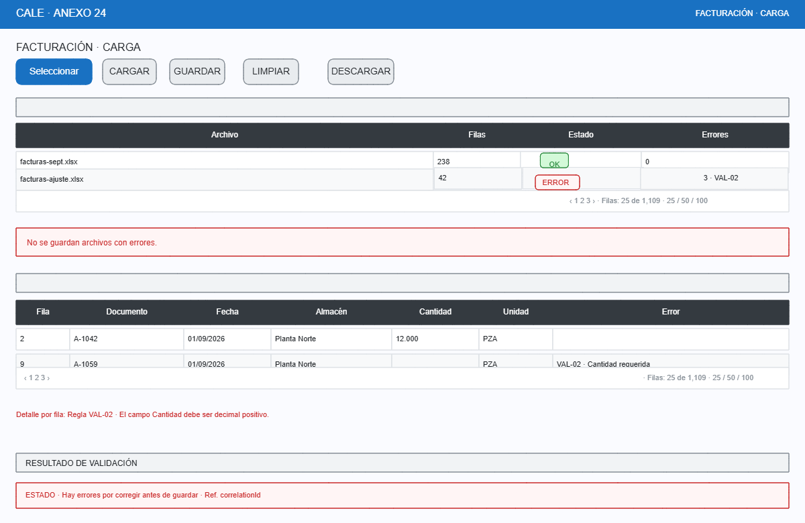

# Facturación: carga de archivos XLS/XLSX

- **Caso de uso:** CU-050 — Cargar facturación.
- **Objetivo:** cargar archivos `.xls`/`.xlsx` con **validación completa antes de guardar**, vista previa y errores localizables (archivo/hoja/fila/columna/valor/regla). Corrige el defecto observado: "carga de facturación no explica plantilla ni errores".
- **Permiso:** cargar / validar / guardar / descargar / ver historial — permisos separados.

## Wireframe



## Flujo

```
1. Seleccionar archivos (.xls/.xlsx, máx. 5, 10 MB c/u)
2. [CARGAR]  → validación inmediata: extensión, tamaño, plantilla/columnas
             → parseo + validación por fila (tipos, obligatorios, catálogos, duplicados, reglas)
             → tabla de archivos con estado (OK / Error)
3. Revisar vista previa y detalle de errores (por hoja/fila/columna/valor/regla)
4. [GUARDAR] → solo si TODOS los archivos están OK → transacción + bitácora + hash SHA-256
5. [LIMPIAR] → descarta archivos seleccionados (confirmación si ya validados)
6. [DESCARGAR] → plantilla oficial vigente para carga
```

## Reglas de validación (orden de ejecución)

| # | Regla | Mensaje (ejemplo) |
|---|---|---|
| 1 | Extensión | "El archivo `x.foo` no es válido. Extensiones permitidas: .xls, .xlsx". |
| 2 | Tamaño | "El archivo excede el tamaño máximo de 10 MB". |
| 3 | Cantidad de archivos | "Máximo 5 archivos por carga". |
| 4 | Plantilla/columnas | "La columna 'Cantidad' no existe o está renombrada. Use la plantilla v1.2". |
| 5 | Tipos de dato | "La celda E12 contiene texto donde se espera un decimal". |
| 6 | Obligatoriedad | "La celda B12 es obligatoria y está vacía". |
| 7 | Catálogo | "La clave DOC-999 no existe en el catálogo de documentos". |
| 8 | Duplicados | "El documento DOC-01 aparece 2 veces en el archivo". |
| 9 | Reglas de negocio | "Cantidad debe ser mayor que cero". |

Cada error muestra: **archivo · hoja · fila · columna · valor enmascarado · código de regla · mensaje** (el valor real se enmascara si contiene datos comerciales sensibles).

## Estado de la carga (historial)

| Campo | Detalle |
|---|---|
| Archivo | Nombre enmascarado + hash SHA-256 (idempotencia: no re-procesa el mismo archivo). |
| Usuario/Fecha | Quién y cuándo. |
| Estado | En proceso / Validada / Guardada / Fallida. |
| Filas/Errores | Totales por archivo. |
| `correlationId` | Para soporte. |

## Validaciones y mensajes clave

| Condición | Comportamiento |
|---|---|
| Archivos con errores | `[GUARDAR]` deshabilitado; banner "No se guardan archivos con errores". |
| Todos OK | `[GUARDAR]` habilitado; confirmación "¿Guardar N archivos (M filas)?" con hash de cada archivo. |
| Guardado exitoso | Toast verde + entrada en historial + bitácora. |
| Duplicado de archivo (mismo SHA-256 ya cargado) | "El archivo ya fue cargado el dd/mm/aaaa (ref: `correlationId`)". |
| Fallo en servidor | Dialog con `correlationId`; nada se guarda parcialmente (transacción). |

## Notas

- `[DESCARGAR]` obtiene la **plantilla oficial vigente** (versión + columnas + reglas), no un archivo de ejemplo improvisado.
- La carga es **transaccional**: o todos los archivos se guardan o ninguno.
- La validación de plantilla se hace contra el diccionario de `PlantillaCarga` (columnas, tipos, obligatoriedad, catálogos) para permitir cambios sin recompilar.