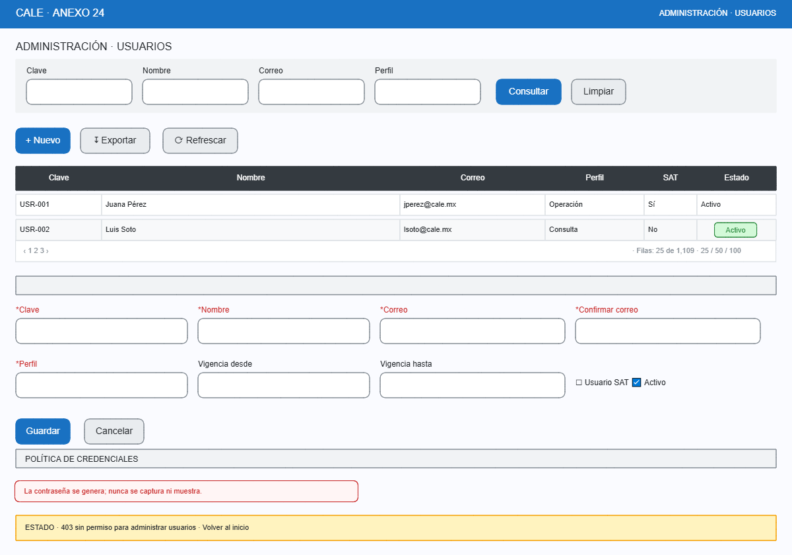
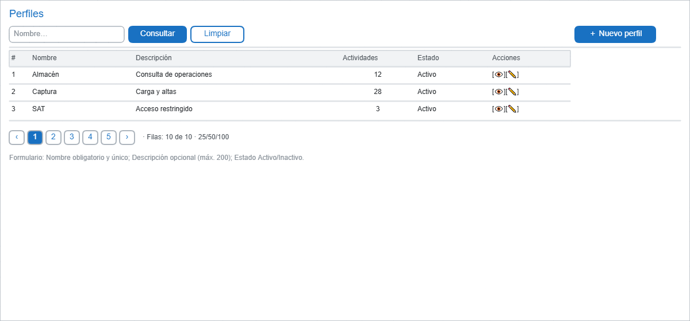
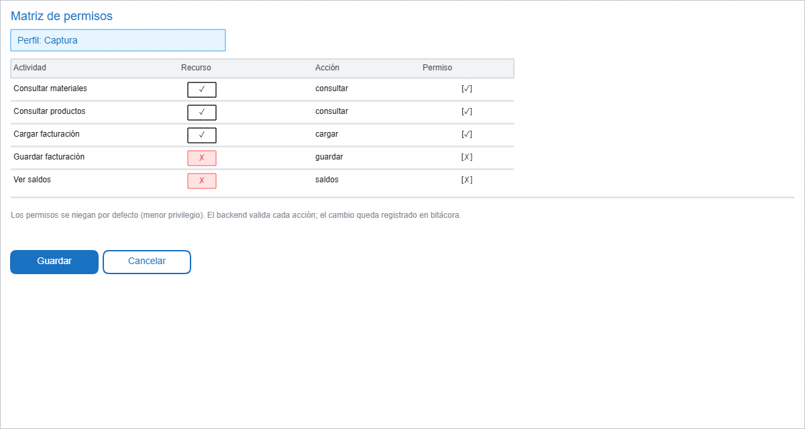

# Administración: Usuarios, Perfiles, Permisos

- **Objetivo:** administrar acceso y autorización de la aplicación. Solo perfiles con permisos administrativos acceden a este módulo.
- **Permiso:** administrar usuarios / perfiles / permisos (permisos separados por acción).
- **Caso crítico heredado:** la auditoría detectó contraseña en texto visible y usuario SAT con permisos amplios → este diseño corrige ambas cosas.

---

## 1. Usuarios

Lista con patrón tabla + formulario de alta/edición.

### Formulario de alta/edición (nunca muestra contraseñas)

| Campo | Reglas |
|---|---|
| Clave | Obligatoria, máx. 35, única. |
| Nombre | Obligatorio, máx. 100. |
| Correo + Confirmar | Formato válido; confirmación debe coincidir. |
| Perfil | Catálogo de perfiles activos. |
| Vigencia | Desde obligatoria; hasta opcional (sin hasta = indefinida). Al vencer, la cuenta deja de iniciar sesión. |
| Usuario SAT | Indicador del usuario con permisos de autoridad fiscal (el sistema registra y audita sus acciones). |
| Contraseña | **Nunca se captura en el formulario**: al crear, se genera temporal (cumple política) y se comunica por canal seguro; no se muestra ni regresa al formulario. |
| Estado | Activo / Inactivo / Bloqueado. |

**Regla de seguridad:** el campo de usuario SAT con permisos amplios ya no puede existir sin auditoría: sus acciones críticas se registran en bitácora y su perfil no incluye permisos que no le correspondan (menor privilegio).

---

## 2. Perfiles

Agrupación de permisos por actividad (52 actividades observadas en el sistema vigente).

| Campo | Reglas |
|---|---|
| Nombre | Obligatorio, único. |
| Descripción | Opcional, máx. 200. |
| Estado | Activo / Inactivo. |

---

## 3. Permisos (matriz perfil × actividad)

Asignación por actividad: recurso + acción (ej. `materiales` + `consultar`). Lista de 52 actividades del sistema vigente, re-mapeada a recursos/acciones de la API.

| Regla | Detalle |
|---|---|
| Menor privilegio | Los permisos se **niegan por defecto**; cada actividad se marca explícitamente. |
| Backend valida | El permiso se valida en la API (no solo ocultando botones en la UI). |
| Trazabilidad | Cada cambio de asignación registra responsable + fecha en bitácora. |
| Sin implícitos | Marcar una actividad no arrastra otras (no hay "permiso de todo el módulo" automático). |

## Notas transversales (administración)

- La contraseña nunca aparece en listas, formularios ni respuestas de API (solo hash para verificación interna).
- Corresponde al diseño de `security.md` (pendiente): JWT, roles, sesión, auditoría.
- Activación/inhabilitación de usuarios exige confirmación (patrón base) por su impacto.
- Exportación de usuarios requiere permiso específico y puede enmascarar correos.