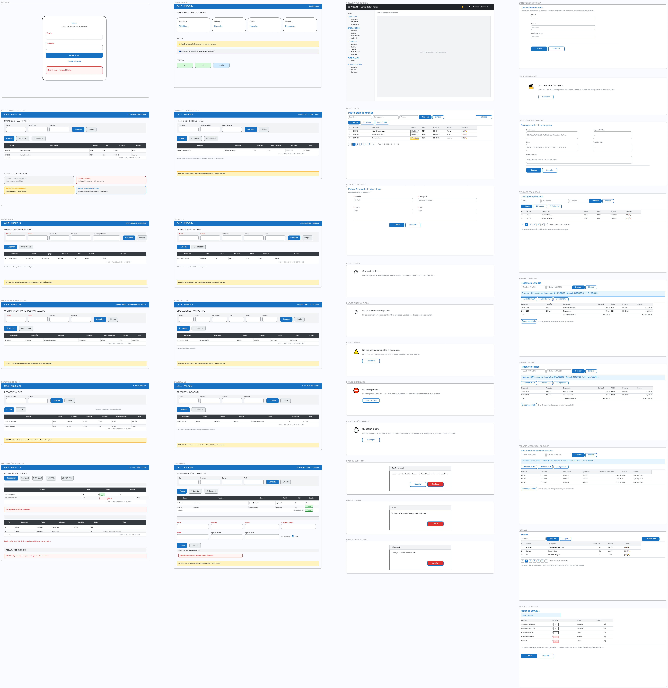

# Prototipos de pantallas (wireframes)

## Objetivo

Definir la estructura visual y de interacción de cada pantalla de la aplicación Anexo 24, antes de implementar la UI. Son **wireframes de referencia**, no diseño final: documentan navegación, distribución, campos, filtros, acciones, estados y mensajes para que todos los módulos usen patrones idénticos.

Fuentes de verdad que alimentan estos wireframes:

- `docs/02-analisis/datos-requeridos-aplicacion.md` — campos y filtros observados en la auditoría.
- `docs/03-diseno/casos-uso.md` — flujos formales (CU-001, CU-030, CU-040, CU-050).
- `docs/00-presentacion/resumen.md` — riesgos y criterios de aceptación (sin secretos en DOM, `correlationId`, errores localizables).

## Convenciones generales

- Los archivos `00-layout-general.md` y `01-login.md` se consideran **patrones base**; el resto los reutiliza.
- Toda tabla usa el patrón: filtros → toolbar → tabla → paginación (ver `00-layout-general.md`).
- Todo formulario usa el patrón: grid de 2 columnas → validación inline → Guardar/Cancelar.
- Pantallas de **consulta** (operaciones, catálogos) son de **solo lectura** salvo indicación contraria.
- Los permisos por módulo referencian la matriz propuesta en `docs/03-diseno/matriz-permisos-propuesta.md`.
- Estado documental: **propuesto** (pendiente de validación con negocio y de prueba con usuarios).

## Mapa de navegación

## Índice de archivos

| # | Archivo | Alcance | Caso de uso |
|---|---------|---------|-------------|
| 00 | `00-layout-general.md` | Shell de la app + patrones de tabla/formulario/estados | — |
| 01 | `01-login.md` | Inicio de sesión, bloqueo, cambio de contraseña | CU-001 |
| 02 | `02-dashboard.md` | Inicio con accesos por permiso | CU-001 (resultado) |
| 03 | `03-catalogos.md` | Datos generales, materiales, productos, estructuras | consultas de catálogo |
| 04 | `04-operaciones.md` | Entradas, salidas, materiales utilizados, activo fijo | CU-030 |
| 05 | `05-reportes.md` | Reportes y exportación con `correlationId` | CU-040 |
| 06 | `06-facturacion.md` | Carga de facturación validada, errores por fila, historial | CU-050 |
| 07 | `07-administracion.md` | Usuarios, perfiles y matriz de permisos | administración |

## Reglas transversales que todos los wireframes respetan

1. **Sin secretos en pantalla ni DOM**: las contraseñas nunca se muestran, editan o devuelven a la UI.
2. **Errores accionables**: todo fallo operacional muestra `correlationId` y mensaje claro; nunca detalles internos.
3. **Menor privilegio**: el usuario solo ve módulos/pantallas/acciones que su perfil autoriza.
4. **Consultas con rango de fechas**: en operaciones el rango es obligatorio antes de consultar.
5. **Confirmación en acciones destructivas** (cancelar carga, eliminar, inhabilitar).
6. **Estados explícitos**: carga, sin datos, error y sin permiso siempre se diseñan, nunca se dejan al azar.