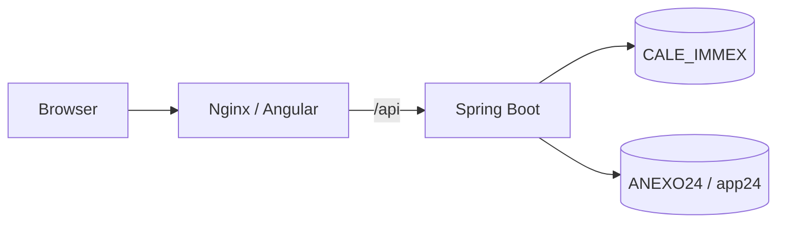

# Contenedores product-like

## Alcance

Esta configuración empaqueta Angular y Spring Boot para una ejecución local
product-like. No despliega a un servidor real, no dockeriza SQL Server y no
modifica las bases externas `CALE_IMMEX` ni `ANEXO24`.

Las decisiones de negocio continúan pendientes:

- `SALDOS = PENDING_BUSINESS`.
- `FACTURACION_CONFIRM = PENDING_BUSINESS`.
- `DASHBOARD_V1 = PENDING_BUSINESS`.

## Arquitectura



- El navegador accede únicamente al frontend publicado.
- Nginx sirve la SPA y reenvía `/api/` al servicio `backend` dentro de la red
  Docker `anexo24`.
- El backend escucha en el puerto interno `8080` y usa explícitamente el perfil
  `prod`.
- Las dos bases de datos son externas; no existe servicio SQL en Compose.
- La red `anexo24` es privada entre servicios, pero no usa `internal: true`:
  el backend necesita egress hacia las bases externas configuradas.
- El backend no publica `8080` al host; sólo recibe tráfico desde Nginx y puede
  salir hacia las bases externas.
- El endpoint `/actuator/health` queda disponible dentro de la red Docker para
  el healthcheck del backend, pero no se publica al host mediante Nginx.

## Artefactos

- `backend/Dockerfile`: build con JDK 21 y runtime con JRE 21.
- `backend/.dockerignore`: excluye `.env`, Git, cachés, build y logs.
- `frontend/Dockerfile`: build Angular con Node 22 y pnpm 12.4.0; runtime Nginx
  unprivileged sin Node.
- `frontend/.dockerignore`: excluye `node_modules`, `dist`, reportes, `.env*`,
  Git y logs.
- `frontend/nginx.conf`: fallback SPA, proxy API, headers y cache de assets.
- `compose.prod.yml`: servicios `backend` y `frontend`, sin base de datos.

## Variables

Compose exige estas variables en el entorno del host; no se escriben valores en
el archivo versionado:

```text
DB_URL
DB_USERNAME
DB_PASSWORD
APP_DB_URL
APP_DB_USERNAME
APP_DB_PASSWORD
JWT_SECRET
JWT_EXPIRATION_MINUTES
APP_CORS_ALLOWED_ORIGINS
```

`FRONTEND_PORT` es opcional y por defecto usa `8088`. `JAVA_TOOL_OPTIONS` es
opcional para opciones JVM. La configuración del navegador usa same-origin
(`/api`), por lo que no necesita una URL absoluta del backend.

No usar `env_file: backend/.env` en Compose. Los valores deben provenir del
mecanismo de secretos o del entorno del proceso que ejecuta Compose. Nunca
crear ni versionar un `.env.prod` real.

## Build

Desde la raíz del repositorio:

```bash
docker compose -f compose.prod.yml build
```

El build del backend ejecuta `./gradlew clean bootJar -x test`; los tests se
consideran gate separado de CI/local. El build del frontend ejecuta
`pnpm install --frozen-lockfile` y `pnpm build`.

El output Angular verificado tiene raíz `dist/frontend` y el contenido browser
se encuentra en `dist/frontend/browser`. El runtime copia únicamente ese
contenido browser al web root.

## Estado de validación

- `STATIC`: PASS. Compose, Dockerfiles, Nginx, puertos y contrato de variables
  fueron revisados; `docker compose config --quiet` pasó con placeholders no
  sensibles.
- `LOCAL_BUILD`: PASS. Backend `bootJar`, frontend build, lint y 80 tests
  frontend pasaron antes de esta fase runtime.
- `DOCKER_ENGINE_AVAILABLE`: **YES**. Docker Desktop respondió en el contexto
  `desktop-linux`.
- `IMAGE_BUILD`: **PASS** para backend y frontend.
- `COMPOSE_UP`: **PASS**; backend healthy y frontend running.
- `NGINX_TEST`, proxy API, SPA smoke, headers y cache: **PASS**.
- El smoke autenticado quedó `NOT_EXECUTED` porque no había credencial autorizada
  disponible; no se fabricó ningún token.

## Ejecución local product-like

Definir las variables obligatorias en el entorno del host sin imprimirlas ni
persistirlas en el repositorio. Después:

```bash
docker compose -f compose.prod.yml up -d
docker compose -f compose.prod.yml ps
```

El frontend se publica en `http://127.0.0.1:8088` por defecto. El backend no
se publica al host; sólo es accesible por la red interna `anexo24`.

## Verificación

```bash
curl -fsS http://127.0.0.1:8088/
curl -fsS http://127.0.0.1:8088/dashboard
curl -fsS http://127.0.0.1:8088/materiales
curl -fsS http://127.0.0.1:8088/reportes
curl -fsS http://127.0.0.1:8088/usuarios
curl -i http://127.0.0.1:8088/api/v1/bitacora
```

Las rutas SPA deben devolver `index.html` y no un 404 de Nginx. La solicitud API
sin token debe responder `401`; esto verifica el recorrido Browser → Nginx →
Spring Boot sin publicar el puerto del backend.

El healthcheck interno puede revisarse sin exponer `8080`:

```bash
docker compose -f compose.prod.yml exec backend \
  curl --fail --silent http://127.0.0.1:8080/actuator/health
```

Si existe una credencial autorizada proporcionada por el ambiente, el login y
una consulta read-only pueden probarse una sola vez a través de
`http://127.0.0.1:8088/api`. No imprimir ni persistir el token. La ausencia de
una credencial autorizada no bloquea el packaging.

## Detención

```bash
docker compose -f compose.prod.yml down
```

No usar `-v`: esta configuración no necesita borrar volúmenes para detener los
servicios.

## Seguridad técnica

- El backend ejecuta como usuario/grupo `anexo24`, no como root.
- El frontend usa `nginxinc/nginx-unprivileged`; no incluye Node en la imagen
  final.
- El backend runtime contiene sólo el boot JAR, JRE, `curl` para healthcheck y
  metadatos mínimos de ejecución.
- No se copian `.env`, credenciales, código fuente TypeScript ni tests en las
  imágenes finales.
- Nginx añade `X-Content-Type-Options`, `Referrer-Policy` y
  `X-Frame-Options: SAMEORIGIN`.
- No se añade una CSP estricta en esta fase para evitar romper Angular/Material;
  es una actividad posterior de hardening si se requiere.
- Los assets con hash reciben cache prolongado; `index.html` no tiene cache
  agresivo para permitir actualizar versiones.
- No se configura WebSocket porque la aplicación no lo usa.
- Los logs se mantienen en stdout/stderr de los contenedores.

## Troubleshooting

| Síntoma | Revisión |
|---|---|
| Docker Desktop instalado pero daemon no responde | Verificar `docker context ls`, `docker version` y `docker info`; no instalar otro engine ni modificar WSL. Este problema ocurrió inicialmente y se resolvió iniciando Docker Desktop normalmente. |
| Compose exige una variable | Definir la variable obligatoria en el entorno del host; no añadirla al YAML. |
| Backend unhealthy | Revisar `docker compose logs backend` y confirmar ambas conexiones externas y el perfil `prod`. |
| SPA devuelve 404 al refrescar | Confirmar `frontend/nginx.conf` y el fallback `try_files ... /index.html`. |
| API devuelve 502 | Confirmar que `backend` está healthy y que Nginx usa `http://backend:8080`. |
| API devuelve 401 | Es esperado sin Bearer token; no agregar Authorization fijo en Nginx. |
| Assets viejos | Recargar `index.html`; los assets hashados se cachean deliberadamente. |

## Límites de esta fase

Este paquete no implementa Saldos, confirmación de Facturación, KPIs de
Dashboard, migraciones, stored procedures, CI de publicación de imágenes ni
deploy a servidor real.
